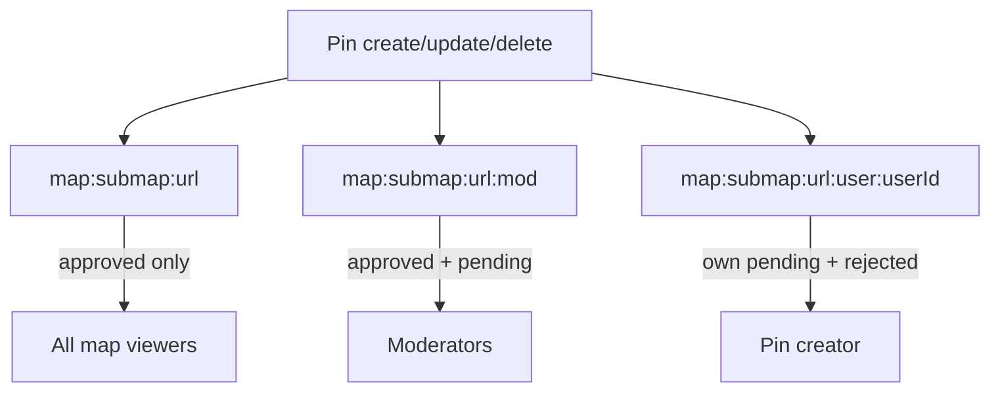

# Creator pin channel (plan)

**Status:** planned — implement later  
**Related:** moderation status UX for creators; interim client fix in `assets/js/react/utils/markerDeleted.ts`  
**Parent context:** [SUB_MAPS.md](./SUB_MAPS.md) realtime section

## Problem

Creators may see their own **pending** and **rejected** sub-map pins via HTTP (`authorize_show`, `sub_map_pins_for_member`). They only subscribe to the **public** sub-map channel (`map:submap:<url>`), which:

- Never receives `marker_added` / `marker_updated` for non-approved pins
- Receives `marker_deleted` whenever a pin is not publicly visible (e.g. reject, or approved → pending)

So live moderation (reject / resubmit / multi-tab create) does not match HTTP visibility. The interim fix refetches `GET /api/pins/:id` on `marker_deleted` for `created_by_me` pins. That recovers correctness after a delete event but does not push status changes as first-class upserts and adds a round-trip per event.

## Goal

Give authenticated creators a **user-scoped realtime topic** for their own creator-visible, non-public pins (`pending` / `rejected`), mirroring the existing moderator channel pattern.

## Locked decisions

| Decision | Choice |
|----------|--------|
| Topic shape | `map:submap:<community_url>:user:<user_id>` |
| Join auth | Socket `user_id` must equal topic `user_id`; sub-map must exist; viewer must `Policy.can_view?` the community |
| Payload | Same as public/mod: `marker_added` / `marker_updated` with `PinJSON.data/1` (or `data_with_user` if client needs `created_by_me` on channel upserts — prefer enriching for this topic so React badges/outlines stay correct), and `marker_deleted` with `%{pin_id: id}` |
| Which pins | Sub-map pins where `pin.user_id == topic user_id` and `status in [:pending, :rejected]` for upserts; true deletes and transitions **out** of creator-only visibility still send `marker_deleted` on this topic when appropriate |
| Public/mod channels | Unchanged semantics (approved public; approved+pending mod). Do **not** put pending/rejected pin bodies on the public topic |
| World map | No creator topic (world pins are approved-only for creators today) |
| Interim refetch | **Keep** `markerDeleted` refetch as a safety net for public-channel deletes until this ships and is verified; afterward, keep it as a cheap fallback (owned pin + public delete → refetch) unless it proves redundant |

## Visibility / broadcast matrix

Align with HTTP `authorize_show` + list rules for non-mod creators.

| Event | Public | Mod | Creator topic (`:user:<owner_id>`) |
|-------|--------|-----|-------------------------------------|
| Create pending | — | `marker_added` | `marker_added` |
| Update pending (still pending) | — | `marker_updated` | `marker_updated` |
| Reject (pending → rejected) | `marker_deleted` | `marker_deleted` (rejected not on mod list today) | `marker_updated` (rejected body) |
| Resubmit (rejected → pending) | `marker_deleted` | `marker_added` / `marker_updated` | `marker_updated` |
| Approve (→ approved) | `marker_added` / `updated` | `marker_updated` | `marker_deleted` **or** `marker_updated` then rely on public upsert — prefer **`marker_deleted` on creator topic** once public carries the approved pin, to avoid duplicate local state races; client should upsert from public |
| Hard delete | `marker_deleted` | `marker_deleted` | `marker_deleted` |
| Archived | as today | as today | `marker_deleted` (creators cannot show archived) |

**Note:** Today mod broadcast treats rejected as not mod-visible (`sub_map_mod_broadcast_visible?`), so reject already deletes on mod. Creator topic is what restores the owner’s live view.

Optional follow-up (out of this plan’s MVP): include **rejected** on the mod channel for live mod queues. Not required for creator UX.

## Implementation outline

### 1. Query helpers — [`lib/storymap/pins/query.ex`](../lib/storymap/pins/query.ex)

Add predicates parallel to public/mod:

- `sub_map_creator_broadcast_visible?(pin, user_id)` — true when `pin.user_id == user_id` and `status in [:pending, :rejected]`
- Document that this matches creator HTTP visibility (not archived)

### 2. Topic helpers + broadcast — [`lib/storymap_web/pin_broadcast.ex`](../lib/storymap_web/pin_broadcast.ex)

- `creator_submap_topic(community_url, user_id)` → `"map:submap:#{url}:user:#{user_id}"`
- In `broadcast_sub_map_pin_event/2`:
  - After public/mod handling, if `pin.user_id` is set, resolve creator topic
  - `:created` / `:updated`: if creator-visible → upsert event; else → `marker_deleted` on creator topic (e.g. approved or archived)
  - `:deleted`: always `marker_deleted` on creator topic for the pin owner (when `user_id` present)

Use `@spec` on new public helpers per AGENTS.md.

### 3. Channel join — [`lib/storymap_web/channels/map_channel.ex`](../lib/storymap_web/channels/map_channel.ex)

Extend `join("map:submap:" <> rest)` parsing order:

1. Ends with `:mod` → existing mod join
2. Matches `*:user:<id>` → creator join (parse `community_url` + `user_id`)
3. Else → public join

Creator join checklist:

- Authenticated `socket.assigns.user_id`
- Integer topic user id equals socket user id (no subscribing to another user’s topic)
- Sub-map exists
- `Policy.can_view?(sub_map, user, membership)`

Reject with `%{reason: "unauthorized"}` / `"community not found"` consistent with mod join.

### 4. JS socket — [`assets/js/map_socket.js`](../assets/js/map_socket.js)

Mirror mod helpers:

- `creatorTopicForCommunityUrl(communityUrl, userId)`
- `getCreatorMapChannel(communityUrl, userId)` / `leaveCreatorMapChannel()`
- Only join when both `communityUrl` and `userId` are present

### 5. React sync — [`assets/js/react/hooks/usePinChannelSync.ts`](../assets/js/react/hooks/usePinChannelSync.ts)

- Accept `userId?: number`
- When `communityUrl && userId`, join creator channel and attach the same `marker_*` listeners as public/mod
- Leave on cleanup / when leaving the community map
- Wire `userId` from [`useMapData.ts`](../assets/js/react/hooks/useMapData.ts) / App (already available for hearts)

Duplicate events (e.g. approved pin on public + delete on creator) must remain idempotent: existing upsert/delete reducers already key by `pin_id`.

### 6. Pin JSON on creator upserts

Prefer broadcasting `PinJSON.data_with_user(pin, user, opts)` for creator-topic upserts so `created_by_me` / `is_owner` stay accurate without an extra GET. If that couples broadcast to a User load, preload owner once in `broadcast_pin_event` when targeting the creator topic.

### 7. Tests

| Area | Coverage |
|------|----------|
| `MapChannel` | Join own creator topic OK; join another user’s topic unauthorized; unauthenticated unauthorized; missing community |
| `PinBroadcast` | Pending create → creator `marker_added`; reject → creator `marker_updated` + public `marker_deleted`; approve → creator `marker_deleted` + public upsert; hard delete → creator `marker_deleted` |
| Query | `sub_map_creator_broadcast_visible?/2` table-driven |
| JS (optional) | Topic string helper unit test if extracted |

### 8. Docs / product

- Update [SUB_MAPS.md](./SUB_MAPS.md) Realtime bullet to list public / mod / creator topics
- After ship: short note in this file Status → **done** with date

## Non-goals

- Pushing another user’s pending/rejected pins to anyone except mods (existing mod channel) and the owner
- Replacing HTTP list/show authorization
- Removing the `markerDeleted` refetch in the first PR (keep until creator channel is covered by tests and manual QA)
- Creator topics on `map:world`

## Rollout / QA checklist

1. Approval-required community: create pin as member → second tab / refresh already has pin; mod rejects → status badge updates live without disappearing
2. Resubmit rejected → pending → dashed outline returns live
3. Mod approves → pin stays, badge clears (public upsert); no flicker-delete if possible
4. Hard delete own pin → disappears
5. Attempt to join `...:user:<other_id>` via console → unauthorized
6. Moderator still receives pending on `:mod` as today

## Implementation order (when building)

1. Query predicate + `PinBroadcast` topic + events + channel join + tests  
2. `map_socket.js` + `usePinChannelSync` + manual QA  
3. Enrich creator payloads with `data_with_user` if badges/`created_by_me` glitch on channel-only upserts  
4. Revisit whether `markerDeleted` refetch can be narrowed (e.g. only when not subscribed to creator channel)
